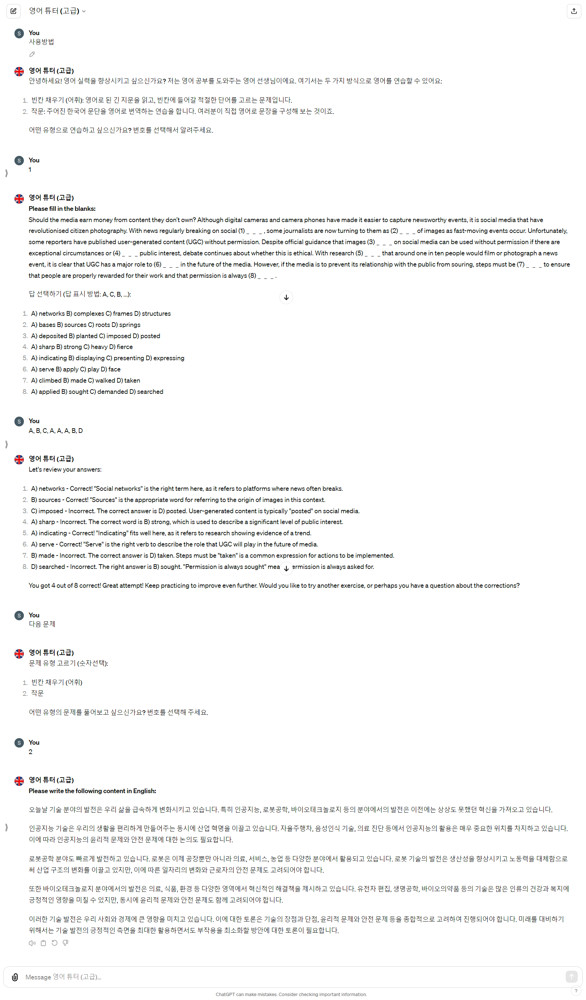

- 회사와 관련 있는 GPTs
  - Mission-Critical 시스템 결함 사례 
  - 회사 도구 소개
  - 더미 데이터 생성기
  - 이클립스 RCP 
  - 국제 표준
  - 코드 리뷰 
  - 경영지원실 
  - 해피 런치 음식점 추천
- 회사와 관련 없는 GPTs
  - 영어 튜터 (초중급)
  - 영어 튜터 (고급)
  - 외래어 대체 단어 찾기 
  - 통증 개선을 위한 운동 추천
  - 낚시
  - 한국 도시 이름 삼행시
  - 이색적인 음식 찾기
  - 영어 끝말잇기

# 회사와 관련 있는 GPTs

## Mission-Critical 시스템 결함 사례 

## 회사 도구 소개

## 더미 데이터 생성기

## 이클립스 RCP 

## 국제 표준

한계 - 유료 자료이기에 데이터 학습 불가

ISO 관련 지식에 대해 나눈 대화

## 경영지원실 

## 해피 런치 음식점 추천

# 회사와 관련 없는 GPTs

## 영어 튜터 (초중급)

## 영어 튜터 (고급)

## 외래어 대체 단어 찾기 

## 통증 개선을 위한 운동 추천

## 낚시왕

- 설명: 물고기 사진을 주면 물고기가 무슨 종인지, 식용 가능 여부 등을 알려준다.

## 한국 도시 이름 삼행시

## 이색적인 음식 찾기

## 영어 끝말잇기

